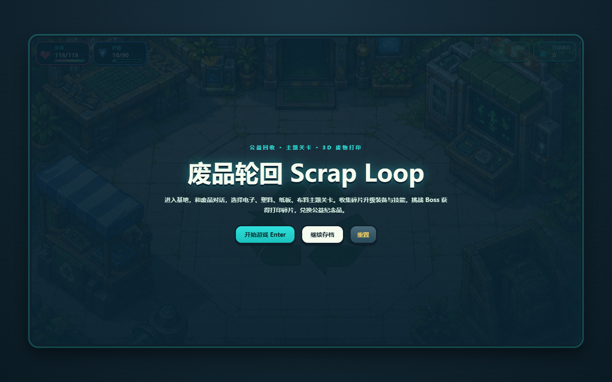

# 废品轮回 · Scrap Loop

一款以环保回收为主题的 2D 俯视角动作冒险游戏。玩家扮演废品回收志愿者，在电子、塑料、纸板、布料四类主题区域中清理污染、收集碎片、升级装备与技能，最终挑战 Boss，并把回收碎片转化为 3D 打印纪念品，完成“收集 → 净化 → 再生”的公益旅程。

## 实际运行效果

下面是仓库直接启动后的游戏标题界面：



## 在线试玩

[https://xingchenyd.github.io/scrap-loop/](https://xingchenyd.github.io/scrap-loop/)

游戏为纯前端项目，不需要账号或后端服务；进度保存在浏览器本地。

## 快速开始

```bash
git clone https://github.com/xingchenyd/scrap-loop.git
cd scrap-loop
python -m http.server 4177 --bind 127.0.0.1
```

打开：

```text
http://127.0.0.1:4177/
```

也可以使用任意静态文件服务器，但不要直接双击 `index.html`，否则部分浏览器会限制资源加载和本地存档能力。

## 玩法循环

1. 进入基地并与 NPC 对话，了解当前污染事件。
2. 从电子、塑料、纸板和布料主题中选择关卡。
3. 在大世界中探索、清障、战斗并收集对应材料碎片。
4. 返回基地，在精炼机中合成装备、强化技能。
5. 完成阶段任务并挑战主题 Boss。
6. 将净化后的碎片兑换为纪念品，形成完整循环叙事。

## 核心内容

- 五幕主线：序章 → 电子 → 塑料 → 纸板 → 布料 → 尾声。
- 四类废料主题：每类拥有独立场景、怪物、设施、装备和纪念品素材。
- 3200 × 2400 像素大世界：包含基地、传送门、主题区域和隐藏空间。
- 装备系统：收集材料后在精炼机中合成并升级装备。
- 技能系统：12 种主动技能，包括回收罩、净化波、低温泡沫和冲刺清扫。
- 特效系统：命中、挥砍、爆炸、冰冻、闪电、毒云、枪口闪光、治疗、护盾和能量涌动。
- 任务系统：碎片回收、污染清障、主题净化和 Boss 挑战。
- 纪念品系统：将关卡产出转化为可展示的公益纪念物。
- 本地存档：保存剧情、角色、装备、背包、任务与设置。

## 操作说明

| 按键 | 功能 |
| --- | --- |
| `WASD` / 方向键 | 移动角色 |
| `Space` / 鼠标左键 | 普通攻击 |
| `Q` | 释放主动技能 |
| `Enter` | 推进对话 / 确认 |
| `E` | 与设施或 NPC 交互 |
| `K` | 打开技能列表 |
| `C` | 打开角色属性 |
| `X` | 打开装备栏 |
| `B` | 打开背包 |
| `M` | 打开地图 |
| `N` | 打开剧情导览 |
| `Esc` | 关闭面板 / 取消 |

## 技术实现

- 原生 HTML、CSS 和 JavaScript，无构建步骤。
- Canvas 2D 渲染地图、角色、敌人和战斗特效。
- 数据驱动的主题资源与关卡配置。
- `localStorage` 保存单机进度。
- PNG 精灵与主题素材直接随仓库发布。
- 静态部署兼容 GitHub Pages、Netlify 和 Cloudflare Pages。

## 目录结构

```text
scrap-loop/
├── index.html                # 页面入口
├── style.css                 # 界面、HUD 与响应式样式
├── main.js                   # 游戏状态、渲染、战斗、任务与存档
├── assets/
│   ├── themes/               # 四类废料的装备、怪物、设施和纪念品
│   └── ...                   # 角色、场景与特效资源
├── scripts/                  # 素材处理脚本
├── tools/                    # 开发辅助工具
├── EFFECT_SPRITE_PROMPTS.md  # 特效精灵设计记录
└── docs/screenshots/         # README 使用的真实运行截图
```

## 部署

### GitHub Pages

1. Fork 或克隆本仓库。
2. 确认 `index.html`、`main.js`、`style.css` 和 `assets/` 完整。
3. 在仓库 `Settings → Pages` 中选择 `main` 分支。
4. 等待构建完成后访问 Pages 地址。

### 其他静态托管

将仓库根目录作为站点根目录直接发布即可，不需要环境变量、数据库或服务端函数。

## 当前边界

- 当前版本为单机浏览器游戏，不提供账号、云存档和跨设备同步。
- 纪念品兑换是游戏内公益叙事与演示机制，不代表真实物流或打印履约。
- 桌面键鼠体验最完整；移动设备可访问，但复杂战斗更适合较大的屏幕。

## 说明

本项目用于环保教育、公益活动和游戏化交互展示。游戏中的回收知识应结合当地最新分类规则与专业处置要求使用。
